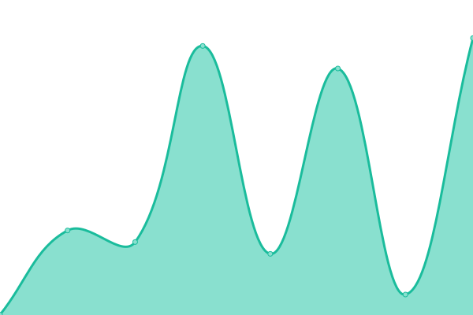

# [📈 Live Status](https://status.discord-html.tk): <!--live status--> **🟩 All systems operational**

This is the repository for the Discord.html status monitor.

<!--start: status pages-->
<!-- This summary is generated by Upptime (https://github.com/upptime/upptime) -->
<!-- Do not edit this manually, your changes will be overwritten -->
<!-- prettier-ignore -->
| URL | Status | History | Response Time | Uptime |
| --- | ------ | ------- | ------------- | ------ |
|  [Demo](https://discordhtml-demo.daguacaplushy.repl.co) | 🟩 Up | [demo.yml](https://github.com/Discord-html/Discord.html-Status/commits/HEAD/history/demo.yml) | 

 263ms
     
 | 

<a href="https://status.discord-html.tk/history/demo">100.00%</a>
    

|  Beta | 🟩 Up | [beta.yml](https://github.com/Discord-html/Discord.html-Status/commits/HEAD/history/beta.yml) | 

 277ms
     
 | 

<a href="https://status.discord-html.tk/history/beta">100.00%</a>
    

|  [Website](https://discord-html.tk) | 🟩 Up | [website.yml](https://github.com/Discord-html/Discord.html-Status/commits/HEAD/history/website.yml) | 

 435ms
     
 | 

<a href="https://status.discord-html.tk/history/website">100.00%</a>
    

|  [Status](https://status.discord-html.tk) | 🟩 Up | [status.yml](https://github.com/Discord-html/Discord.html-Status/commits/HEAD/history/status.yml) | 

 589ms
     
 | 

<a href="https://status.discord-html.tk/history/status">100.00%</a>
    

|  API | 🟩 Up | [api.yml](https://github.com/Discord-html/Discord.html-Status/commits/HEAD/history/api.yml) | 

 196ms
     
 | 

<a href="https://status.discord-html.tk/history/api">99.98%</a>
    

<!--end: status pages-->

[**Visit our status website →**](https://status.discord-html.tk)

## 📄 License

- Powered by: [Upptime](https://github.com/upptime/upptime)
- Code: [MIT](./LICENSE) © [Discord.html](https://discord-html.tk)
- Data in the `./history` directory: [Open Database License](https://opendatacommons.org/licenses/odbl/1-0/)
